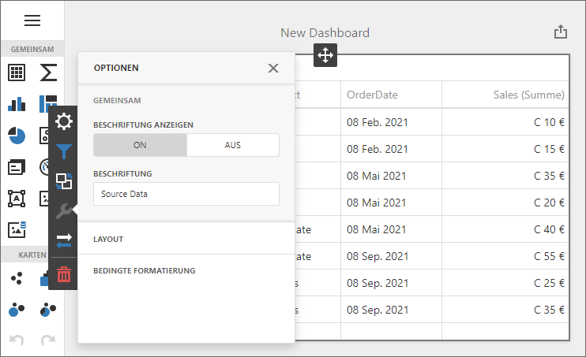

<!-- default badges list -->

<!-- default badges end -->
# BI Dashboard for ASP.NET Web Forms - Localization

The example shows how to localize an ASP.NET Web Forms Dashboard application:

- Translate UI element captions to a different language: dialog boxes, buttons, menu items, error messages, etc.
- Format numbers, dates, and currencies according to specific culture settings.

## Example Structure

The example contains two projects that show how to localize the Web Dashboard control in case _automatic_ or _manual_ script integration. Both projects localize the ASP.NET Web Forms Dashboard control for the German market with the [satellite resource assemblies](https://docs.devexpress.com/Dashboard/400833/web-dashboard/aspnet-web-forms-dashboard-control/localization#localize-ui). The control uses Globalize to format to dates, numbers, and currencies. 

The example also shows how to apply custom formatting for numbers and dates.

### Automatic Script Registration

*Files to Review:*

* [Default.aspx](./CS/DashboardLocalizationWeb/Default.aspx)
* [Web.config](./CS/DashboardLocalizationWeb/Web.config)

The **DashboardLocalizationWeb** project registers client libraries automatically. Globalize is included when you [register third-party libraries](https://docs.devexpress.com/Dashboard/402121/web-dashboard/aspnet-web-forms-dashboard-control/required-client-libraries#automatic-integration).

### Manual Script Registration

*Files to Review*:

* [Default.aspx](./CS/DashboardLocalizationManualWeb/Default.aspx)
* [Web.config](./CS/DashboardLocalizationManualWeb/Web.config)

The **DashboardLocalizationManualWeb** project prevents the Web Dashboard control from loading client libraries automatically and references [Globalize and other libraries](https://docs.devexpress.com/Dashboard/402121/web-dashboard/aspnet-web-forms-dashboard-control/required-client-libraries#manual-integration) on the web page.

## Documentation

- [Localize ASP.NET Web Forms Dashboard Control](https://docs.devexpress.com/Dashboard/400833/web-dashboard/aspnet-web-forms-dashboard-control/localization)

## More Examples

- [ASP.NET Core Dashboard Control - Localization](https://github.com/DevExpress-Examples/asp-net-core-dashboard-localization)
- [ASP.NET MVC Dashboard Extension - Localization](https://github.com/DevExpress-Examples/asp-net-mvc-dashboard-localization)
- [Dashboard for Angular - Localization](https://github.com/DevExpress-Examples/angular-dashboard-localization)
- [Dashboard for React - Localization](https://github.com/DevExpress-Examples/react-dashboard-localization)
- [Dashboard for Vue - Localization](https://github.com/DevExpress-Examples/vue-dashboard-localization)
- [Dashboard Control for JavaScript Applications - Localization](https://github.com/DevExpress-Examples/javascript-dashboard-localization)
